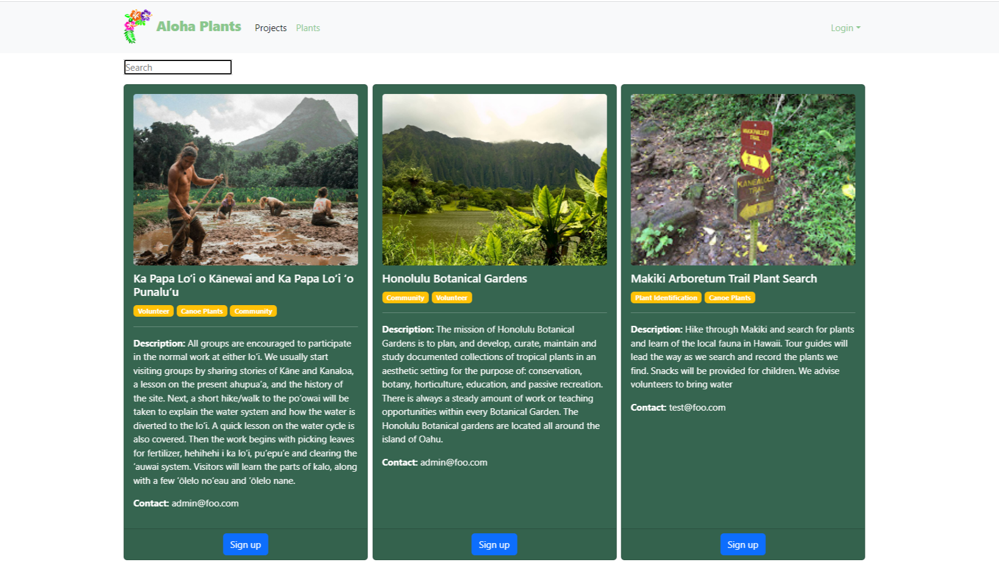

# Aloha Plants

## Our Team
Ethan Burks - Undergraduate student at the University of Hawaiʻi at Mānoa Information and Computer Sciences

Austin Dang - Undergraduate student at the University of Hawaiʻi at Mānoa Information and Computer Sciences

Brian Dang - Undergraduate student at the University of Hawaiʻi at Mānoa Information and Computer Sciences

[Justin Lisoway](https://justinlisoway.github.io/) - Graduate student at the University of Hawaiʻi at Mānoa Finance and Information and Computer Sciences

[Joel Nicolow](https://jnicolow.github.io/) - Undergraduate student at the University of Hawaiʻi at Mānoa Information and Computer Sciences and Public Health

[Team Contract](https://docs.google.com/document/d/11s41Tvha4MiEvYDh8vSLZo-ZFsDw1gTq5bLksJaobW0/edit)

## Overview
### The Problem
Due to Hawaiʻis geographical isolation Hawaiʻi is characterized by by high biodiversity with over 10,000 species found nowhere else on earth [2]. Today, up to 95% of Hawaii’s dryland forest has been destroyed while only 40% of mesic forest remains [3].  segue
Hawaii imports around 80-90% of its food at a cost of around $3 billion annually. A 2012 report from the Office of Planning Department of Business and Economic Development and Tourism in cooperation with the Hawaii State Department of Agriculture estimates that just replacing 10% of imported foods with local grown food would amount to $313 million dollars remaining in the state (rather leaving the state economy) [1].
If people have the knowledge they can plant native and canoe plants at their work and homes including for food cultivation. Not only will this increase biodiversity and establish strong communities of native plants in our urban areas. But cultivation of food including with canoe and native plants can help alleviate the hawaii food crisis. Home gardens have a great potential to generate massive amounts of produce. For example by the end of World War II 40% of produce in the US was from (home) victory gardens [4]. 

Due to Hawaii's geographical isolation, the state has high biodiversity with over 10,000 species found nowhere else on earth [2]. However, Hawaii has experienced significant destruction of its dryland forest, with up to 95% destroyed, and only 40% of mesic forest remaining [3].

Hawaii currently imports around 80-90% of its food, costing the state approximately $3 billion annually. However, a 2012 report from the Office of Planning Department of Business and Economic Development and Tourism, in cooperation with the Hawaii State Department of Agriculture, estimated that replacing just 10% of imported foods with locally grown food would keep $313 million dollars in the state economy [1].

If people have the knowledge, they can plant native and canoe plants at their workplaces and homes for food cultivation. This would increase biodiversity and establish strong communities of native plants in urban areas. Cultivation of food, including with canoe and native plants, can also help alleviate Hawaii's food crisis. Home gardens have a great potential to generate significant amounts of produce. For example, by the end of World War II, 40% of produce in the US was from victory gardens [4].

[1] Increased Food Security and Food Self-Sufficiency Strategy. Office of Planning Department of Business Economic Development & Tourism.
https://files.hawaii.gov/dbedt/op/spb/INCREASED_FOOD_SECURITY_AND_FOOD_SELF_SUFFICIENCY_STRATEGY.pdf

[2] https://dlnr.hawaii.gov/forestry/files/2013/09/SWARS-Issue-6.pdf

[3] State of Hawaiʻi, Department of Land and Natural Resources (DLNR) (2016) Hawaiʻi Forest Action Plan 2016, 306 p. Division of Forestry and Wildlife.

[4] Victory Garden at the National Museum of American History. https://gardens.si.edu/gardens/victory-garden/

### The Solution
The “Aloha Plants” website allows you to search and view different native plants, forums, and community projects. When searching for native plants it will provide information on how to grow native species and the specific areas to cultivate the plants. This aids the fauna in Hawaii by giving resources to the community to allow them to increase biodiversity by hand. The user will also be exposed to various resources that foster community interaction such as the forums page and community projects page on the website. This will also give the community information to grow their own foods, which will allow the user’s within the community to potentially alleviate the hawaii food crisis.The website will also allow creator users to add in unlogged native plant species to provide users a new native plant variety to grow. This will allow us to log all plant species in a cloud environment, which can be provided to scientific institutes such as the College of Tropical Agriculture and Human Resources and The University of Hawaiʻi at Mānoa Botany Department.

## User Types 
**Non-user**: Users that have not created a profile first visit the landing page where they can browse plants, projects, and forums. However, they will not be able to create or reply to forums.

**User**: Users that have created a profile are able to browse plants, projects, and forums. Also given the ability to create, or reply to forums.

**Admin**: Admin account is granted permissions to edit, create plants, projects, as well as forums just like the previous user types. They are also able to delete user accounts.

## Use case ideas
- User lands on landing page (accessible without account) example plants, projects, and forums are displayed and navbar links to plant browser, project browser, and forum page
- New user, logs in, able to check relevant projects/recent forums. There will be a button “create forum” which allows users with accounts to create a forum (image, title, description, interests)
- Admin user, logs in, able to search for projects, forums, people, and plants. Able to edit each card type (I.E projects, forums, people, and plants). There is a create button which opens a form allowing user to create a plant, project, or forum
- Creator user, logs in, able to search for projects, forums, and plants. Able to edit each card type (I.E projects, forums, and plants). There is a create button which opens a form allowing user to create a plant, project, or forum

## Beyond the basics
- Implementing a chat system between users
- Email notifications for new projects
- Email Notification for deleted forum of user
- Adding a upvote/rating system on forums

## User Guide
When you first enter the page you are greeted with the aloha-plants landing page.

As a non user you are able to view the project browser:

And the plant browser:

## M1
[Milestone 1](https://github.com/orgs/tech-for-a-greener-hawaii/projects/2)

## M2
[Milestone 2](https://github.com/orgs/tech-for-a-greener-hawaii/projects/3/views/2)

## M3
[Milestone 3](https://github.com/orgs/tech-for-a-greener-hawaii/projects/5/views/1)

## [Deployment](https://aloha-plants.online/)
